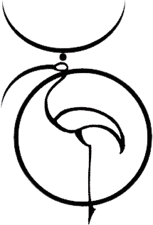
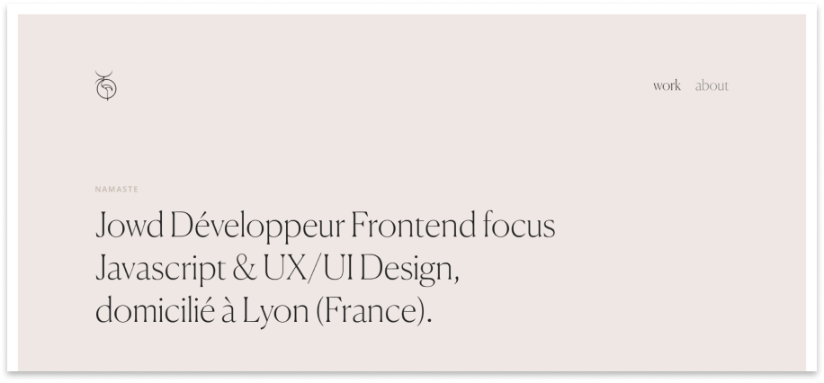
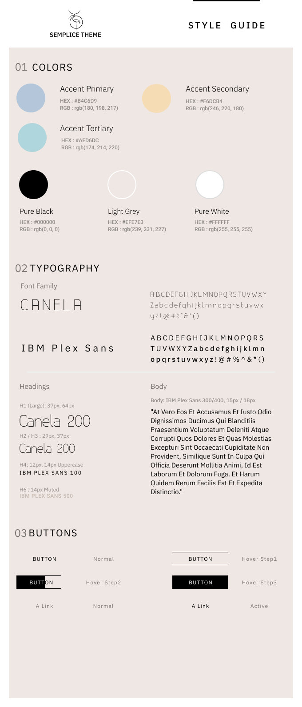

<div align="center">
<h1>Semplice Theme</h1>

<br />

<a href="#">
  
</a>

<br />

<p>Simple and complete Theme Portfolio from Vai Pandana personal website, reproduced from scratch only with Dev Tools and Browser's Plugins and customized with personals infos for professionals purposes</p>

<br />

<a href="#">
  
</a>

<br />

<div>Font made from 
  <a href="http://www.onlinewebfonts.com">oNline Web Fonts</a>
  is licensed by CC BY 3.0
</div>

</div>


## Getting Started

Semplice-theme is a simple design portfolio for frontend developer, inspired and more than that, following a kind of "design & structure guidelines" from the Vandana Pai's own portfolio, a senior product designer working at Spotify. Of course you can visit her site [lifeofpai.com](http://lifeofpai.com/), which I believe representing a perfect model of student case explanations, and efficient minimalist design ...

Inroducing myself, I'm Julien as Jowd another "unknown developer", self-educated from France, trying to upgrade my skills and experience learning with some of the best personnalities, professionnals, projects and contents I think we have chance to cross over the web.  

[Visit My Portfolio]([https://website-project-adress-link/](https://codeisamystic.github.io/semplice-clone-portfolio/))

## Case Study, for student case...

On project#.html files, I've tried to demonstrate some parts of problems I've worked on in a 3 projects choice. I focused only on 3 projects to have a better explanation to job I made, to add more details on what I've done sure but also on what I think it's important. Giving a overview of different topics, good approaches & practices. The Vai's website was a usefull helper to structure my work on those sections. 

## Design 

Reading the Vai's Design was a nice experience, because it's so clean, with lots of "air space", defining patterns in a really great way. The components are clearly designed, the layouts are clean and the hard parts was to define a grid because of the richness and mix of patterns so different from each other. 
I used the B.E.M Methodology, the S.M.A.C.S.S files architecture and various notions of designing websites attempting to have in mind a great visual of her design.

### Created and Following a Style Guide

This project was also an opportunity, reading the design, to create a quick style guide to introduce rules to follow. Only colors, logo, typo, buttons and links,  in order to have a quick overview of the styles used on this project...

<div align="center">

  <br />

  

</div>


### B.E.M Methodology, Atomic Design...

Lorem ipsum dolor sit amet consectetur adipisicing elit. Ducimus veniam suscipit explicabo officia distinctio quas sint recusandae nobis tenetur, similique illum ex totam provident consectetur.


## Dependencies

### Webpack, Babel, PostCSS...

I used on this project some of the most populars node packages to my workflow, you can easily have a look on package.json file. All the configuration, settings and scripts are defined on the webpack.config.js


## Developing

Fork the repository using [this](https://docs.github.com/en/github/getting-started-with-github/fork-a-repo) guide, then clone it locally.

```shell
git clone https://github.com/CodeIsaMystic/semplice-clone-portfolio
cd name-of-your-app-folder
npm install
```

You can now run the frontend on your `localhost:3000`.

```shell
npm run dev
```